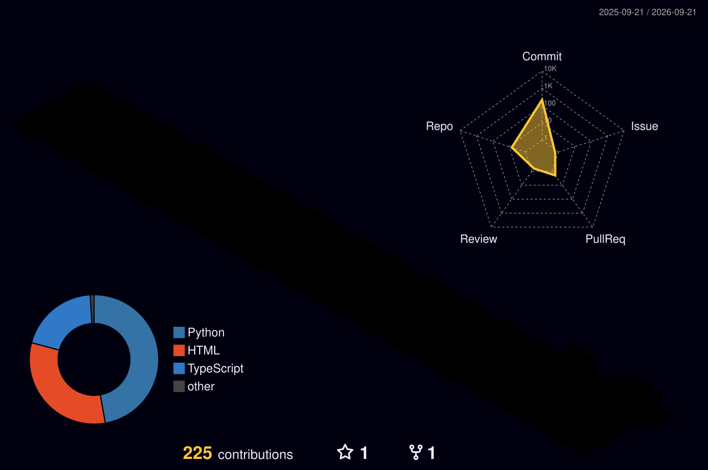

<!-- profile photo, pulled straight from the GitHub avatar, framed with a rounded green border -->

  

<!-- this is a typing animation: a small free service that turns plain text into an animated SVG text effect -->
<!-- "lines=" is just my intro lines separated by semicolons, it types each one out then moves to the next -->

 

### About

I am a student and I'm building AI and web projects — currently developing PYROS (an AI assistant) and other tools using AI-assisted development.

- [PYROS](https://github.com/Aashish-Yadav7/PYROS) — an AI assistant project
- [Live-Map-and-News](https://github.com/Aashish-Yadav7/Live-Map-and-news) — a live map and news project built with TypeScript
- [LLMs-Kingdoms](https://github.com/Aashish-Yadav7/LLMs-Kingdoms) — exploring LLM-driven experiences

I like building things that combine AI-assisted development with practical, usable tools, and I'm always experimenting with new stacks.

 

### 3D Contribution Graph

<!-- generated daily by a GitHub Action (yoshi389111/github-profile-3d-contrib), real isometric 3d bars from my actual contribution data -->

 

### Stats

<!-- hexagon panels with a subtle pulse animation - currently fixed numbers, can be wired to auto-update -->

 

### Tech Stack

<!-- skillicons.dev just draws logos for whatever tech names you list after "i=" -->

 

### GitHub Stats

<!-- these two cards pull live numbers from my GitHub account automatically, nothing hardcoded -->
<!-- using github-stats-extended instead of the original vercel host, since that one keeps going down from overuse -->
<!-- cache_seconds=60 means it refreshes every minute, so numbers catch up fast after a new commit -->

 

### Contribution Snake

<!-- this eats through my real contribution calendar, one square at a time -->

 

### Connect

  

<!-- pirate ship animation, sits at the very bottom -->

