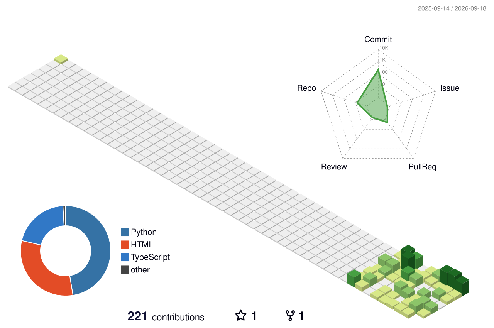

<!-- serif-style typing text, black on white, quiet and minimal -->

 

<!-- a thin horizontal rule instead of a colorful banner - keeps the top quiet -->

  

### About

I am a student and I'm building AI and web projects — currently developing PYROS (an AI assistant) and other tools using AI-assisted development.

&nbsp;

- [PYROS](https://github.com/Aashish-Yadav7/PYROS) — an AI assistant project
- [Live-Map-and-News](https://github.com/Aashish-Yadav7/Live-Map-and-news) — a live map and news project built with TypeScript
- [LLMs-Kingdoms](https://github.com/Aashish-Yadav7/LLMs-Kingdoms) — exploring LLM-driven experiences

&nbsp;

I like building things that combine AI-assisted development with practical, usable tools, and I'm always experimenting with new stacks.

  

### Contribution Graph

<!-- generated daily by a GitHub Action (yoshi389111/github-profile-3d-contrib), white background variant -->

  

### Stats

<!-- four pentagon radar charts, monochrome graphite on white -->

  

### Tech Stack

<!-- light icon theme to sit cleanly on white -->

  

### GitHub Stats

<!-- light theme, thin black border, no bright accent colors -->

  

### Activity

<!-- gravity animation, replaces the old snake - my initials fall and collide with my contribution blocks -->

  

  

### Connect

  

<!-- quiet wave divider, no ships, muted blue on white -->

