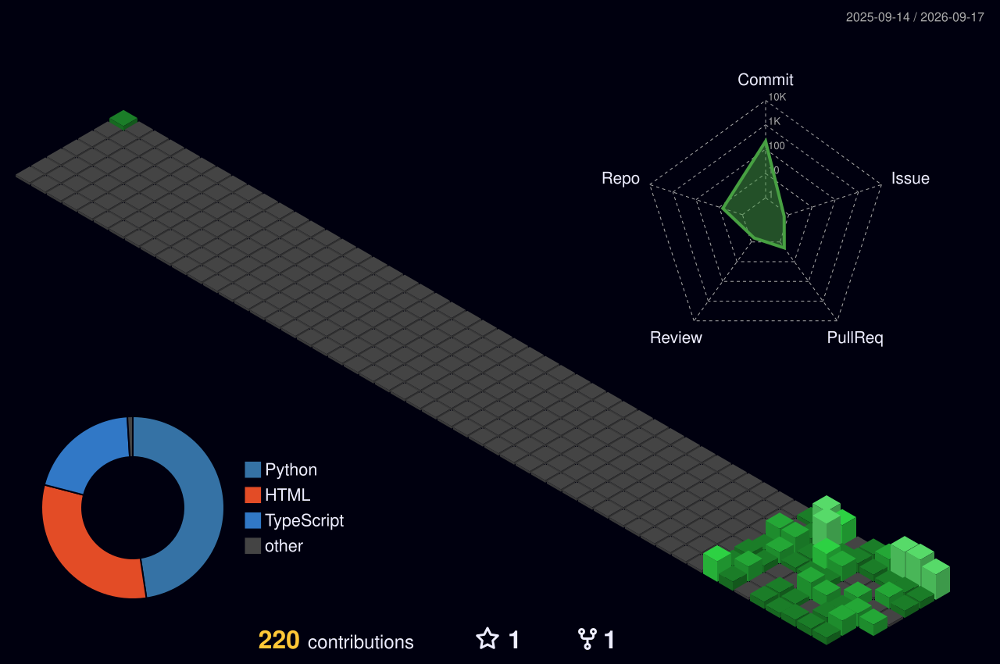

<!-- bright typing text, matches the rest of the page's dark theme -->

 

### About

I am a student and I'm building AI and web projects — currently developing PYROS (an AI assistant) and other tools using AI-assisted development.

- [PYROS](https://github.com/Aashish-Yadav7/PYROS) — an AI assistant project
- [Live-Map-and-News](https://github.com/Aashish-Yadav7/Live-Map-and-news) — a live map and news project built with TypeScript
- [LLMs-Kingdoms](https://github.com/Aashish-Yadav7/LLMs-Kingdoms) — exploring LLM-driven experiences

I like building things that combine AI-assisted development with practical, usable tools, and I'm always experimenting with new stacks.

 

### Contribution Graph

<!-- generated daily by a GitHub Action (yoshi389111/github-profile-3d-contrib), dark green theme -->

 

### Stats

<!-- four pentagon radar charts - Languages, Git Activity, Consistency use real data pulled from the GitHub API, refreshed every 3 hours. Skills is a manual self-rating (labeled as such on the chart itself). -->

 

### Tech Stack

 

### GitHub Stats

 

### Activity

<!-- gravity animation, replaces the old snake - my name falls and lands on top of my contribution blocks -->

 

### Connect

  

<!-- wave divider, no ships, blue -->

